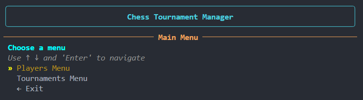
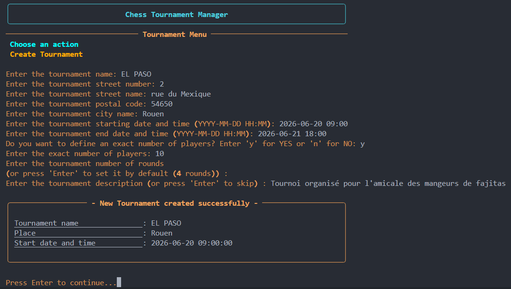
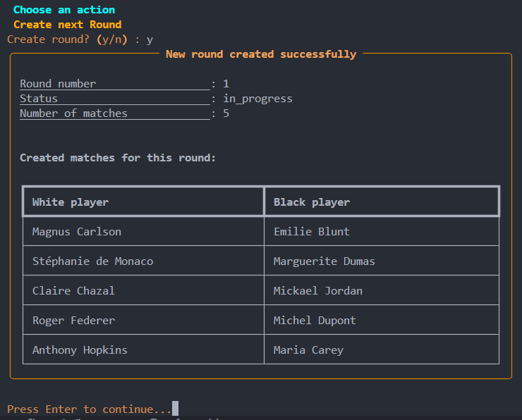
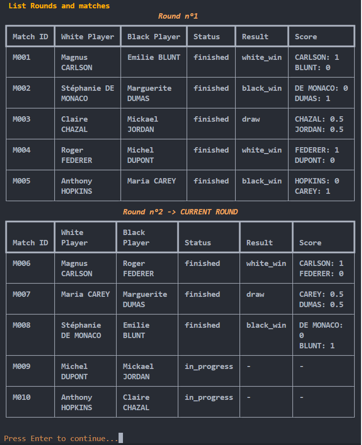

# Chess Tournament Manager

A Python command-line application for managing chess tournaments.

The application allows users to register players, create tournaments, generate rounds and matches, enter match results, and consult tournament reports. Data is persisted locally using JSON files.

Developed as part of the OpenClassrooms Python Application Developer curriculum, the project follows an MVC-inspired architecture and applies object-oriented programming principles.

---

## Features

### Player Management

* Create players
* View all registered players
* Display detailed player information

### Tournament Management

* Create tournaments
* View all tournaments
* Add players to tournaments
* Create tournament rounds
* End rounds
* End tournaments

### Match Management

* Automatic player pairing
* Match result entry
* Score calculation
* Ranking updates

### Reports

* All players
* All tournaments
* Tournament players
* Tournament rounds
* Tournament matches

---

## Screenshots

### Main Menu



### Tournament Creation



### Round Generation



### Tournament Report



---

## Installation

### Clone the repository

```bash
git clone https://github.com/Armand310888/chess-tournament-manager.git
cd chess-tournament-manager
```

### Create a virtual environment

```bash
python -m venv .venv
```

### Activate the virtual environment

Linux / macOS:

```bash
source .venv/bin/activate
```

Windows:

```bash
.venv\Scripts\activate
```

### Install dependencies

```bash
pip install -r requirements.txt
```

---

## Launch the Application

```bash
python -m src.main
```

---

## Code Quality

Run flake8:

```bash
flake8 src
```

Generate an HTML report:

```bash
flake8 src --max-line-length=119 --format=html --htmldir=flake8_rapport
```

---

## Project Structure

```text
src/
├── controllers/
├── models/
├── repository/
├── services/
├── utils/
└── views/
```

### Architecture Overview

* **Models** encapsulate business entities and rules.
* **Controllers** coordinate application workflows.
* **Views** manage user interaction and console display.
* **Repositories** handle JSON persistence.
* **Services** provide reusable business logic.

---

## Data Persistence

Application data is stored locally using JSON files.

Data is automatically created and maintained by the application.

Persisted entities include:

* Players
* Matches
* Rounds
* Tournaments

---

## Match Representation

Each match is modeled through a dedicated `Match` class.

To comply with the project specification, a match exposes a tuple representation through the `match_representation` property:

```python
(
    [white_player, white_player_score],
    [black_player, black_player_score]
)
```

---

## Author

Armand Delaporte

OpenClassrooms – Python Application Developer Program
